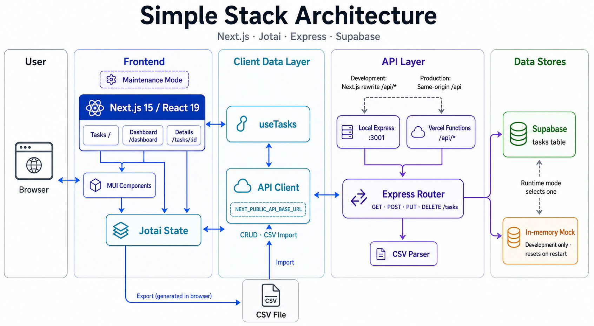

# Simple Stack

Next.js App Router、TypeScript、MUI で構築したタスク管理ボードです。タスクの CRUD、進捗の可視化、CSV 入出力を、Express API と Supabase またはローカルのインメモリ API で試せます。

## 主な機能

- タスクの一覧表示、追加、編集、削除、詳細表示
- ステータス（未着手・進行中・完了）による絞り込み
- 20 件単位のページネーション
- デスクトップ向けテーブルとモバイル向けカードのレスポンシブ表示
- ステータス、優先度、期限を集計するダッシュボード
- 表示中のタスクの CSV ダウンロードと CSV 一括インポート
- 環境変数で切り替えられるメンテナンス画面

## 技術スタック

- Next.js 15 / React 19 / TypeScript
- MUI 7 / Emotion
- Jotai
- Express
- Supabase

## アーキテクチャ



## 画面

| パス         | 内容                            |
| ------------ | ------------------------------- |
| `/`          | タスク一覧・CRUD・CSV 入出力    |
| `/dashboard` | ステータス、優先度、期限の集計  |
| `/tasks/:id` | タスク詳細                      |
| `/login`     | ログイン UI（認証処理は未実装） |

## セットアップ

Node.js 22 と Yarn 1.x を推奨します。

```bash
yarn install
cp .env.example .env
```

### Supabase を使わずに試す

ターミナルを 2 つ開き、インメモリの mock API とフロントエンドを起動します。mock API のデータはプロセスを終了するとリセットされます。

```bash
# Terminal 1
yarn dev:mock

# Terminal 2
yarn dev
```

ブラウザで `http://localhost:3000` を開いてください。Next.js の開発サーバーは `/api/*` を `http://localhost:3001/api/*` に転送します。

### Supabase を使う

Supabase Dashboard の SQL Editor で次のクエリを実行し、API が利用する `tasks` テーブルを作成します。既存の同名テーブルがある場合は、先にスキーマとデータを確認してから個別にマイグレーションしてください。

```sql
create table public.tasks (
  id uuid primary key default gen_random_uuid(),
  title text not null check (btrim(title) <> ''),
  description text not null check (btrim(description) <> ''),
  status text not null default 'todo'
    check (status in ('todo', 'in_progress', 'done')),
  priority text not null default 'medium'
    check (priority in ('low', 'medium', 'high')),
  assignee text not null check (btrim(assignee) <> ''),
  due_date date,
  created_at timestamptz not null default now(),
  updated_at timestamptz not null default now()
);

create index tasks_created_at_idx
  on public.tasks (created_at desc, id desc);
```

このアプリはブラウザから Supabase を直接呼び出さず、Express API がサーバー専用の `service_role` key を使ってアクセスします。続けて次のクエリを実行し、RLS を有効化したうえで `anon` と `authenticated` からテーブル権限を削除します。

```sql
alter table public.tasks enable row level security;

revoke all privileges on table public.tasks
  from public, anon, authenticated;

grant select, insert, update, delete on table public.tasks
  to service_role;
```

この構成では RLS Policy を意図的に作成しません。`anon` と `authenticated` はテーブル権限も Policy も持たず、`service_role` を使うサーバー API だけが CRUD を実行できます。将来 Supabase Auth を導入してブラウザから直接アクセスする場合は、ユーザー単位の Policy と必要最小限の権限を別途追加してください。

設定後、`.env` に接続情報を記述します。`SUPABASE_SERVICE_ROLE_KEY` は RLS を迂回できるため、ブラウザへ公開せずサーバー環境だけに設定してください。

```dotenv
SUPABASE_URL=https://your-project-ref.supabase.co
SUPABASE_SERVICE_ROLE_KEY=your_service_role_key
```

参考: [Row Level Security](https://supabase.com/docs/guides/database/postgres/row-level-security)、[Securing your API](https://supabase.com/docs/guides/api/securing-your-api)

```bash
# Terminal 1
yarn dev:api

# Terminal 2
yarn dev
```

## 環境変数

`.env.example` をコピーし、利用する API に合わせて接続情報やオプションを設定します。

| 変数                           | 用途                                     | 既定値                  |
| ------------------------------ | ---------------------------------------- | ----------------------- |
| `NEXT_PUBLIC_API_BASE_URL`     | ブラウザから利用する API のベース URL    | `/api`                  |
| `SUPABASE_URL`                 | Supabase プロジェクト URL                | なし                    |
| `SUPABASE_SERVICE_ROLE_KEY`    | サーバー専用の Supabase service role key | なし                    |
| `PORT`                         | Express API の待受ポート                 | `3001`                  |
| `CORS_ORIGIN`                  | 許可する Origin。複数指定はカンマ区切り  | `http://localhost:3000` |
| `NEXT_PUBLIC_MAINTENANCE_MODE` | `true` の場合にメンテナンス画面を表示    | `false`                 |

`SUPABASE_SERVICE_ROLE_KEY` はブラウザ側のコードや `NEXT_PUBLIC_*` 変数に設定しないでください。

ローカル開発では `NEXT_PUBLIC_API_BASE_URL` を未設定にすると Next.js の `/api` rewrite を利用します。別ポートの API を直接呼ぶ場合は `http://localhost:3001` を指定します。本番環境では未設定時に同一 Origin の `/api` を使用します。

## API

Express ルーターはローカル用のルートと `/api` プレフィックス付きルートの両方を受け付けます。

| Method   | Path            | 内容           |
| -------- | --------------- | -------------- |
| `GET`    | `/health`       | ヘルスチェック |
| `GET`    | `/tasks`        | タスク一覧     |
| `GET`    | `/tasks/:id`    | タスク詳細     |
| `POST`   | `/tasks`        | タスク作成     |
| `POST`   | `/tasks/import` | CSV 一括登録   |
| `PUT`    | `/tasks/:id`    | タスク更新     |
| `DELETE` | `/tasks/:id`    | タスク削除     |

CSV インポートは JSON の `{ "csv": "..." }` を受け取ります。必要なヘッダーは `課題, 説明, ステータス, 優先度, 担当者, 期限` です。ダウンロード CSV に含まれる `ID` 列はインポート時に無視されます。ステータスには `未着手`、`進行中`、`完了`、優先度には `低`、`中`、`高` を指定します。

## 開発コマンド

```bash
yarn dev          # Next.js 開発サーバー
yarn dev:api      # Supabase を使う Express API
yarn dev:mock     # インメモリの Express API
yarn build        # プロダクションビルド
yarn start        # ビルド済みアプリを起動
yarn lint         # ESLint
yarn format:check # Prettier の差分確認
yarn format       # Prettier を適用
```

## ディレクトリ構成

```text
src/app/        Next.js App Router のルート
src/views/      画面単位の UI
src/components/ 再利用 UI コンポーネント
src/context/    Jotai の状態と API 操作
src/api/        API クライアント
src/utils/      CSV 入出力
server/         Supabase API、mock API、CSV パーサー
api/            Vercel Functions のエントリーポイント
```
